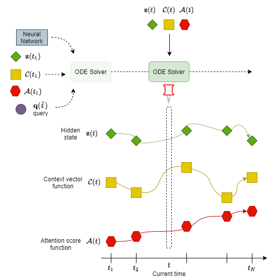
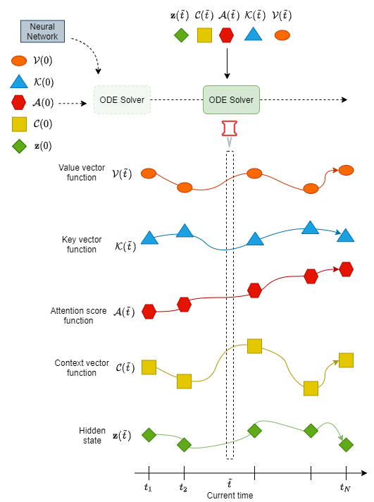
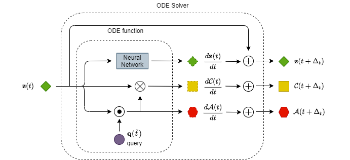
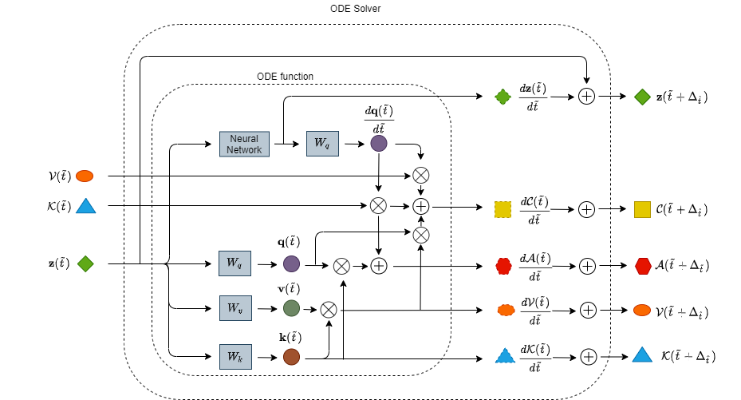
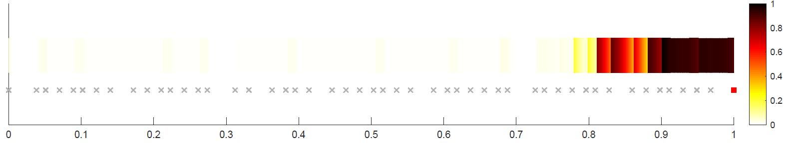
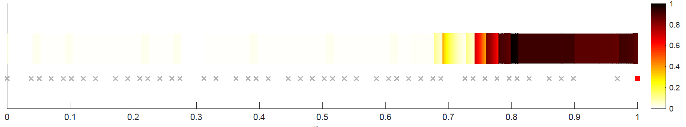
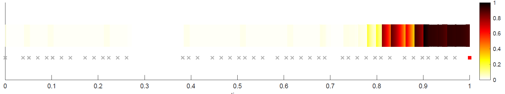
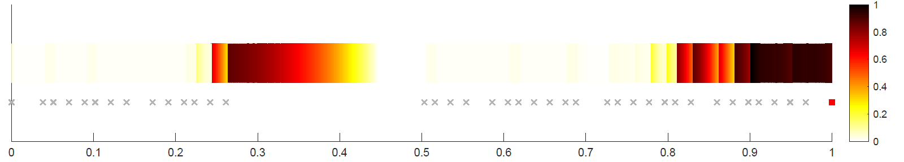
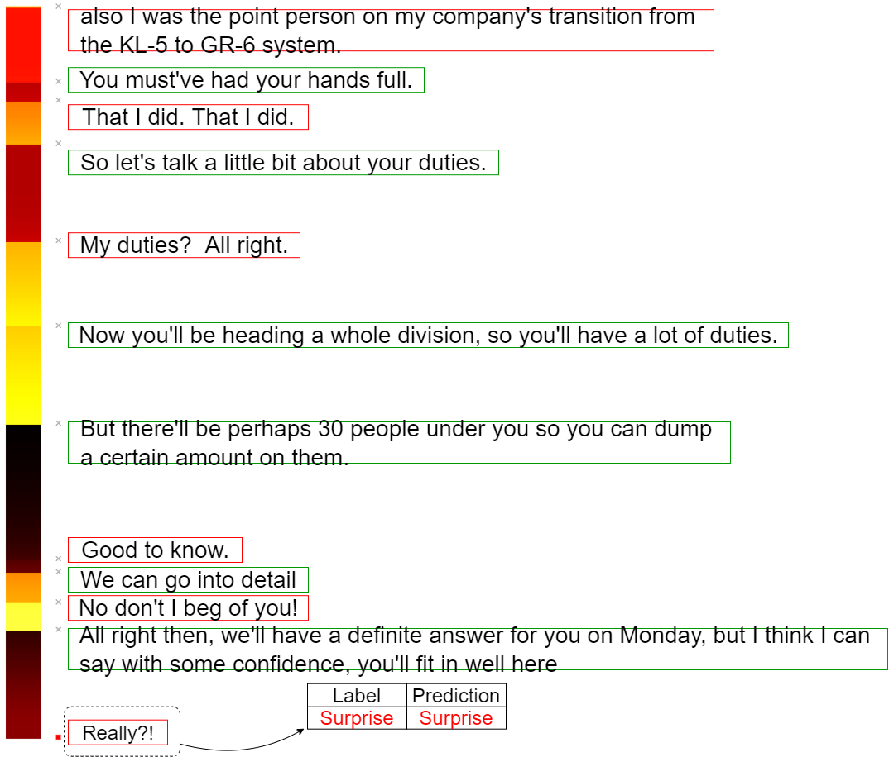
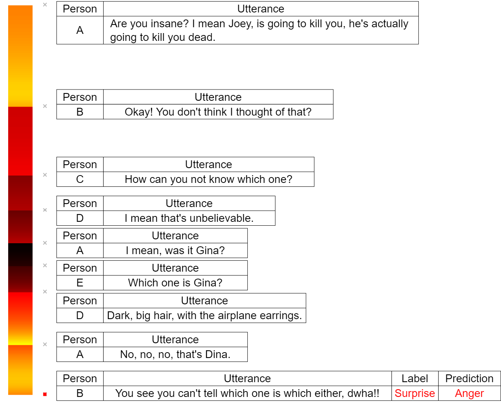

# Continuous-Time Attention
Attention mechanism is crucial for sequential learning where a wide range of applications have been developed. This mechanism is basically trained to spotlight on the region of interest in hidden states of sequence data. Most of the attention methods compute the attention score through relating between a query and a document where the discrete-time state trajectory is represented. Such a discrete-time attention could not directly attend the continuous-time trajectory which is represented via neural differential equation combined with recurrent neural network. This paper presents a new continuous-time attention method for sequential learning which is tightly integrated with the neural differential equation to construct an attentive continuous-time state machine. The continuous-time attention is performed at all times over the hidden states of any kinds of regular or irregular time signals. The missing information in sequence data due to sampling loss is seamlessly compensated and attended in learning representation. The experiments on regular and irregular sequence samples from human activities, dialogue sentences and medical features show the merit of the proposed continuous-time attention for activity recognition, sentiment classification and mortality prediction, respectively.

<h3 style="text-align:center">Illustration for forward pass</h3>



<h3 style="text-align:center">Dynamics</h3>




## Requirement
Install ```torchdiffeq``` from https://github.com/rtqichen/torchdiffeq.

## Folder Directory
```
──data/     ---putting data in here
──datasets/     ---class for different dataset
   ├──meld.py
   ├──person_activity.py
   └──physionet
──experements/     ---folder for saving model
──lib/     ---library for this work
   ├──base_models.py
   ├──create_latent_ode_model.py
   ├──diffeq_solver.py     ---solving ODE function
   ├──encoder_decoder.py     ---building recurrent encoder
   ├──latent_ode.py
   ├──layers.py     ---layers for ODE function
   ├──likelihood_eval.py     ---functions to compute loss
   ├──ode_func.py     ---ODE function to compute dynamics
   ├──ode_rnn.py     ---main class for model
   ├──parse_datasets.py     ---building dataloader
   ├──plotting.py
   ├──rnn_baselines.py
   └──utils.py
──logs/     ---folder for saving log file
──results/
──preprocessing_meld.ipynb     ---preprocess code for meld
──run_models.py     ---main function
```
## Configuration 
```python
## paremater for dataset
-n                          # size of the dataset
--dataset                   # select a dataset

## paremater for training
--niters                    # set number of iteration
--lr                        # set learning rate
-b, --batch-size            # set batch size
-r, --random-seed           # set a random seed

## file path
--save                      # path for save checkpoints
--load                      # ID of the experiment to load for evaluation

## model type
--classic-rnn               # RNN baseline
--ode-rnn                   # ODE-RNN baseline
--latent-ode                # Latent ODE model

## model structure
--att                       # discrete-time attention mechanism
--catt                      # continuous-time attention mechanism
--catt-v2                   # causal continuous-time attention mechanism
--with-t                    # create net with time

## paremater for model
-l, --latents               # size of the latent state
--rec-dims                  # Dimensionality of the recognition model
--rec-layers                # number of layers in ODE func (recognition)
--gen-layers                # number of layers in ODE func (generation)
-u, --units                 # number of units per layer in ODE func
-g, --gru-units             # number of units per layer in GRU

## classification
--classif                   # do classification task
--linear-classif            # use a linear classifier instead of 1-layer NN
```

```
Note:
If you want to work on MELD, there are several part you should modify (denoted by "# for meld" in code)
──base_models.py
──encoder_decoder.py 
──likelihood_eval.py
──ode_rnn.py
──rnn_baselines.py
──run_models.py
It will be modified in later version
```

### Running different datasets
+ Human Activity
```
python3 run_models.py --niters 200 -n 10000 -l 15 --dataset activity --ode-rnn  --rec-layers 4 --units 500 --gru-units 50 --classif --linear-classif --catt --with-t 
```

+ PhysioNet
```
python3 run_models.py --niters 40 -n 8000 -l 20 --dataset physionet --ode-rnn  --rec-layers 3 --units 50 --gru-units 50 --quantization 0.016 --classif --linear-classif --catt --with-t -b 20
```

+ Multimodal EmotionLines Dataset (MELD)
```
python3 run_models.py --niters 300 -n 2000 -l 50 --dataset meld --ode-rnn --lr 1e-3 -b 20 --classif --linear-classif --catt --with-t
```

### Running different models
+ Classic RNN
```
python3 run_models.py --niters 200 -n 10000 -l 15 --dataset activity --classic-rnn --classif --linear-classif
```

+ Classic RNN + discrete-time attention
```
python3 run_models.py --niters 200 -n 10000 -l 15 --dataset activity --classic-rnn --classif --linear-classif --att
```

+ ODE-RNN
```
python3 run_models.py --niters 200 -n 10000 -l 15 --dataset activity --ode-rnn --classif --linear-classif
```

+ ODE-RNN + discrete-time attention
```
python3 run_models.py --niters 200 -n 10000 -l 15 --dataset activity --ode-rnn --classif --linear-classif --att
```

+ Time variant ODE-RNN
```
python3 run_models.py --niters 200 -n 10000 -l 15 --dataset activity --ode-rnn --classif --linear-classif --with-t
```

+ Time variant ODE-RNN + discrete-time attention
```
python3 run_models.py --niters 200 -n 10000 -l 15 --dataset activity --ode-rnn --classif --linear-classif --att --with-t
```

+ Att-NDE
```
python3 run_models.py --niters 200 -n 10000 -l 15 --dataset activity --ode-rnn --classif --linear-classif --catt --with-t
```

+ Causal Att-NDE
```
python3 run_models.py --niters 200 -n 10000 -l 15 --dataset activity --ode-rnn --classif --linear-classif --catt-v2 --with-t
```

+ Latent ODE
```
python3 run_models.py --niters 200 -n 10000 -l 15 --dataset activity --latent-ode --rec-dims 100 --rec-layers 4 --gen-layers 2 --units 500 --gru-units 50 --classif --linear-classif
```

+ Att-Latent ODE

```
python3 run_models.py --niters 200 -n 10000 -l 15 --dataset activity --latent-ode --rec-dims 100 --rec-layers 4 --gen-layers 2 --units 500 --gru-units 50 --classif --linear-classif --catt
```

## Dataset
### Human Activity
Raw data is available from https://archive.ics.uci.edu/ml/datasets/Localization+Data+for+Person+Activity
Place them in ```data/```
```Download automatically```

### PhysioNet
Raw data is available from https://physionet.org/physiobank/database/challenge/2012/
Place them in ```data/```
```Download automatically```

### MELD
Raw data is available from https://github.com/declare-lab/MELD
Place them in ```data/MELD/raw```
```Run preprocessing_meld.ipynb first```

## Experiment
### Attention score on Human activity

<h4 style="text-align:center">Attend on full sequence</h4>


<h4 style="text-align:center">Attend on sequence removing important part</h4>


<h4 style="text-align:center">Attend on sequence removing unimportant part</h4>


<h4 style="text-align:center">Attend on sequence with wide range dropping</h4>


### Attention score on MELD

<h4 style="text-align:center">Example for two persons</h4>


<h4 style="text-align:center">Example for more than three persons</h4>


## Code References
+ https://github.com/YuliaRubanova/latent_ode
